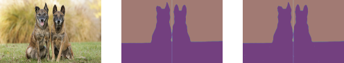

# Symmetric Object Detection
Detect symmtric object by using [Segment Anything Model](https://github.com/facebookresearch/segment-anything) (SAM)

This repo use the Segment Anything Model

# Installation
## Installation of SAM
```
pip install git+https://github.com/facebookresearch/segment-anything.git
```
Noting that pytorch and torchvision is required in prior to install SAM. Additionally, please install the prereuisite of SAM
```
pip install opencv-python pycocotools matplotlib onnxruntime onnx
```

Following the instruction [here](https://github.com/facebookresearch/segment-anything#model-checkpoints) to setup SAM checkpoint from SAM and prepare images to be detected
```
--- images
  |
  -- *.jpg or *.png
--- models
  |
  -- *.pth
```

# Run the scrip
```
python symmetric_seg.py
```

where please specify the model_path accordingly and detection parameters, such as thetas, iou_threshold, and area_ratio_threshold.

```
if __name__ == '__main__':
    model_path = "./models/sam_vit_h_4b8939.pth"
    image_paths = glob('./images/*')
    filtered_segs, filtered_axes, max_ious, max_thetas = symmetric_images_detection(model_path, image_paths, 
        thetas=np.arange(0, 180, 30), 
        iou_threshold=0.8, 
        area_ratio_threshold=0.1)

    for image_path, filtered_seg, filtered_axis, max_theta in zip(image_paths, filtered_segs, filtered_axes, max_thetas):
        if len(filtered_seg) == 0:
            continue
        file_basename = os.path.basename(image_path).split('.')[0]
        fig, axes = plt.subplots(1, len(filtered_seg) + 1)
        image = cv2.imread(image_path)
        image = cv2.cvtColor(image, cv2.COLOR_BGR2RGB)
        
        axes[0].imshow(image)
        axes[0].axis('off')
        for seg, sym_axs, axis in zip(filtered_seg, filtered_axis, axes[1:]):
            axis.imshow(seg, alpha=0.5)
            axis.imshow(sym_axs, alpha=0.5)
            axis.axis('off')
            axis.set_frame_on(False)
        
        plt.savefig(os.path.join("./outputs", f"{file_basename}_output.png"), bbox_inches='tight', pad_inches=0)
        plt.close()
```
This script detects the symmetric axis of the objects in all the images under dir images, and return the axis if it is detected.

# Results
Extract the symmetric masks from SAM

- The detector successfully find the symmetric axis.

<!-- #region -->
<p align="center">

</p>
<!-- #endregion -->

<!-- #region -->
<p align="center">

</p>
<!-- #endregion -->

<!-- #region -->
<p align="center">

</p>
<!-- #endregion -->

- The detector works even for multiple symmetric axes with various angles.

<!-- #region -->
<p align="center">

</p>

<!-- #endregion -->


